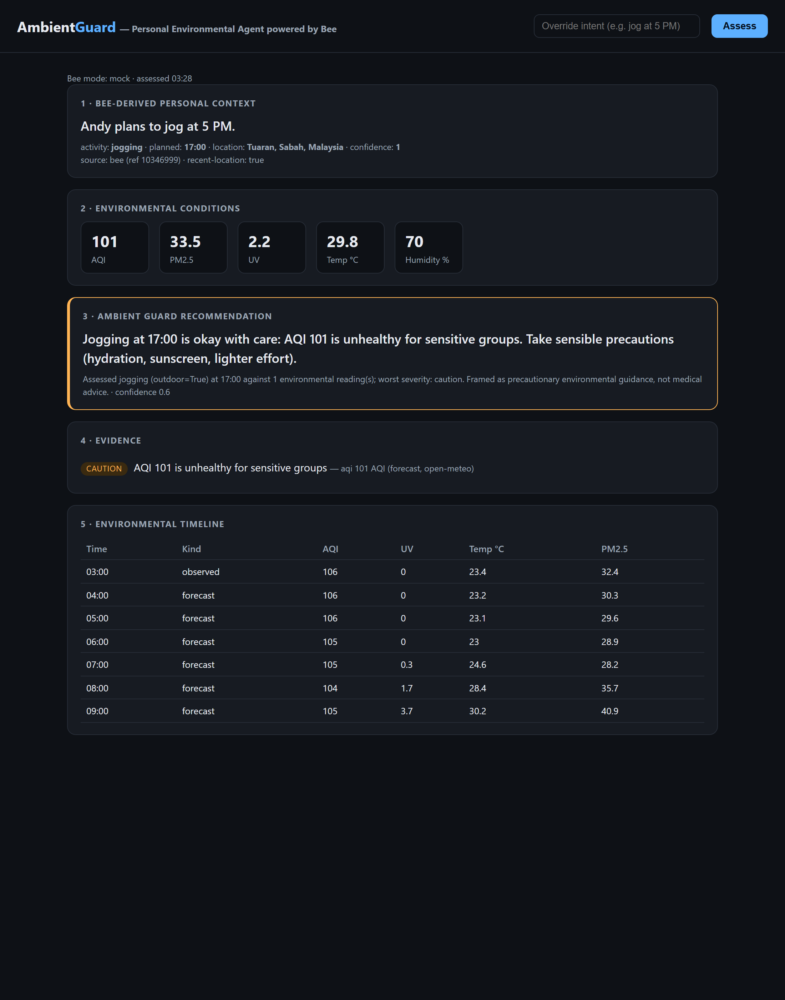

# Milestone 6 — Demo UI screenshot evidence

Date: 2026-09-07 · captured with Playwright/Chromium (headless) against the running
backend at http://127.0.0.1:18080/ in AMBIENT_GUARD_BEE_MODE=mock.

The single-page UI shows the five mandatory panels for the hero scenario
("Andy plans to jog at 5 PM"):

1. **Bee-derived personal context** — intent text, activity=jogging, planned 17:00,
   location Tuaran/Sabah, confidence 1, source ref, recent-location flag.
2. **Environmental conditions** — AQI 101, PM2.5 33.5, UV 2.2, Temp 29.8°C, Humidity 70%
   (live Open-Meteo data).
3. **Ambient Guard recommendation** — "Jogging at 17:00 is okay with care: AQI 101 is
   unhealthy for sensitive groups. Take sensible precautions…" (caution tier, amber border),
   with the reasoning summary explicitly framing it as precautionary, not medical.
4. **Evidence** — CAUTION pill: "AQI 101 is unhealthy for sensitive groups — aqi 101 AQI
   (forecast, open-meteo)", i.e. traced to a source-attributed observation.
5. **Environmental timeline** — hourly AQI/UV/Temp/PM2.5, observed vs forecast.

Note: environmental values are LIVE from Open-Meteo (real network); only the Bee context
is the mock hero fixture (the user's real Bee feed has no jog phrase yet).

## Demo flow recording (GIF + mp4)

`screenshots/M6_demo_flow.gif` (and the higher-quality `screenshots/M6_demo_flow.mp4`)
records the full interactive flow, captured with Playwright/Chromium:
load → initial assessment renders → scroll through evidence + timeline →
type an intent override ("run at 6 AM") → re-assess → scroll the updated result.
Produced by `scripts/record.py` + ffmpeg palettegen. Environmental data is live
Open-Meteo; Bee context is the mock hero fixture.
